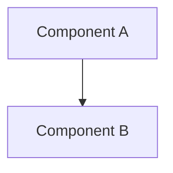

# Design: {Feature Name}

**Status:** DRAFT | APPROVED  
**Issue:** {ISSUE-KEY}  
**Author:** {agent or human}  
**Date:** {YYYY-MM-DD}

---

## 1. Overview

What this feature does and why it's needed. 2–3 sentences.

## 2. Current State

How the system works today. Cite specific files, functions, and data flows.

## 3. Requirements

### Functional
- FR-1: ...
- FR-2: ...

### Non-functional
- NFR-1: ...

## 4. Architecture

### Component diagram



### Data flow

| Step | Component | Action |
|------|-----------|--------|
| 1 | ... | ... |

### New components

| Component | File path | Purpose | Complexity |
|-----------|-----------|---------|------------|
| ... | `src/...` | ... | S/M/L/XL |

### Modified components

| Component | File path | Change | Complexity |
|-----------|-----------|--------|------------|
| ... | `src/...` | ... | S/M/L/XL |

## 5. Interface Contracts

### Input
```json
{ "field": "type" }
```

### Output
```json
{ "field": "type" }
```

## 6. Error Handling

| Scenario | Handling | Recovery |
|----------|----------|----------|
| ... | ... | ... |

## 7. Configuration

| Setting | Default | Description |
|---------|---------|-------------|
| ... | ... | ... |

## 8. Risks and Mitigations

| Risk | Impact | Mitigation |
|------|--------|------------|
| ... | High/Medium/Low | ... |

## 9. Open Questions

Questions for the product owner. **Do not proceed to implementation until
these are answered.**

- [ ] Q1: ...

## 10. Decision Log

| Decision | Rationale | Alternatives considered |
|----------|-----------|----------------------|
| ... | ... | ... |
